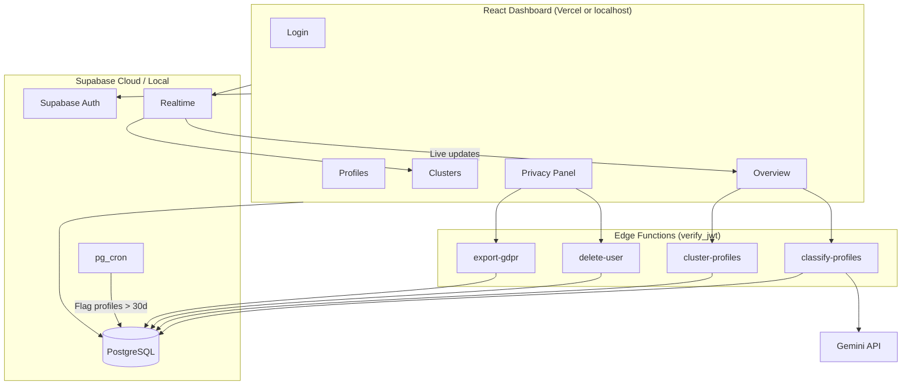

# PoliticaAI — Political Discourse Analysis System

End-to-end full-stack application for analyzing **synthetic** political discourse data. The system generates fake profiles and posts via Gemini, classifies political leanings with AI, clusters ambiguous profiles using **TF-IDF document embeddings and k-means** (no embedding API), and exposes everything through a real-time admin dashboard with GDPR compliance features.

> **Important:** This project uses **synthetic data only**. No real social media data or personal information from real individuals is collected or processed.

---

## Live Demo & Source Code

| Resource | Link |
|----------|------|
| **Live Dashboard** (Vercel + Supabase Cloud) | [Live Dashboard](https://hive-50gjeg767-bayan-s-projects3.vercel.app) |
| **GitHub Repository** | [GitHub](https://github.com/Bayanyahya5/hive) |

**Two ways to run the app:**

| Option | Who it's for | What you need |
|--------|----------------|---------------|
| **A — Live dashboard** | Reviewers, quick demo | Browser + admin login (provided with submission) |
| **B — Local development** | Developers cloning the repo | Node, Docker, Supabase CLI, Gemini API key |

---

## Table of Contents

- [Quick Start](#quick-start)
- [Tech Stack](#tech-stack)
- [Architecture](#architecture)
- [Project Structure](#project-structure)
- [Database Schema](#database-schema)
- [Prerequisites](#prerequisites)
- [Option A — Use the Live Dashboard](#option-a--use-the-live-dashboard)
- [Option B — Local Development](#option-b--local-development)
- [Seeding Synthetic Data](#seeding-synthetic-data)
- [Running the Dashboard](#running-the-dashboard)
- [AI Classification Pipeline](#ai-classification-pipeline)
- [GDPR Features](#gdpr-features)
- [Edge Functions & Security](#edge-functions--security)
- [Deployment (Vercel + Supabase Cloud)](#deployment-vercel--supabase-cloud)
- [Environment Variables](#environment-variables)
- [Real Data Considerations](#real-data-considerations)
- [Known Limitations](#known-limitations)

---

## Quick Start

### Option A — Live dashboard (recommended for reviewers)

1. Open the [Live Dashboard](https://hive-50gjeg767-bayan-s-projects3.vercel.app).
2. Sign in with the **admin credentials** provided in your submission (not stored in this repo).
3. Explore **Overview**, **Profiles**, **Clusters**, and **Privacy**.
4. Optional: click **Run Classification Pipeline** on Overview (you must be logged in).

### Option B — Local development

1. Install [prerequisites](#prerequisites) for local dev.
2. Follow [Option B — Local Development](#option-b--local-development).
3. Seed the database: `cd frontend && npm run seed`.
4. Open **http://localhost:5173** and sign in with a user you create in local Supabase Studio.

---

## Tech Stack

| Layer | Technology |
|-------|------------|
| **Frontend** | Vite + React 19 + TypeScript |
| **Hosting (production)** | [Vercel](https://vercel.com) — root directory `frontend` |
| **Styling** | Tailwind CSS v4, Lucide React, Recharts |
| **Backend / DB** | [Supabase Cloud](https://supabase.com) — PostgreSQL, Auth, Realtime, Edge Functions |
| **AI Engine** | Google Gemini (`gemini-2.5-flash-lite` for classification and seeding) |
| **Clustering** | TF-IDF document embeddings + k-means (Edge Function, no AI API) |
| **Migrations** | Supabase CLI SQL migrations with Row Level Security (RLS) |
| **Scheduling** | `pg_cron` — flags profiles older than 30 days |

---

## Architecture

Production: **React SPA on Vercel** → **Supabase Cloud** (Auth, DB, Realtime, Edge Functions) → **Gemini API** (classification only).



### Data Flow

1. **Seed** — `npm run seed` (from `frontend/`) generates 200 synthetic profiles (5–15 posts each) and consent logs via Gemini.
2. **Classify** — Overview triggers `classify-profiles` (authenticated) → party + confidence (0–1) in `classifications`.
3. **Cluster** — Profiles labeled `unclear` get TF-IDF embedding vectors, k-means grouping, and keyword extraction in `clusters`.
4. **Realtime** — Overview and Clusters subscribe to Postgres changes.
5. **GDPR** — Privacy Panel: consent, retention badges, export, opt-out, cascade deletion.

---

## Project Structure

```
/
├── frontend/                    # Vite + React (npm scripts live here)
│   ├── src/pages/               # Login, Overview, Profiles, Clusters, Privacy
│   ├── package.json
│   ├── .env.example
│   └── .env.local               # Local secrets (gitignored)
├── supabase/
│   ├── config.toml              # Edge Functions, verify_jwt = true
│   ├── migrations/
│   └── functions/
│       ├── classify-profiles/
│       ├── cluster-profiles/
│       ├── delete-user/
│       └── export-gdpr/
├── scripts/
│   ├── seed.js                  # LLM seeder (200 profiles)
│   └── finish-seed.js           # Fallback (30 profiles)
├── vercel.json                  # SPA rewrites for Vercel
└── README.md
```

---

## Database Schema

All tables are in `public` with RLS enabled. Authenticated admin has full access (assignment scope).

| Table | Purpose | Key fields |
|-------|---------|------------|
| `profiles` | Synthetic users | `name`, `city`, `age_range`, `needs_deletion`, `created_at` |
| `posts` | Posts per profile | `profile_id` (FK → CASCADE), `content` |
| `classifications` | AI output | `party`, `confidence` (0–1), `cluster_id` |
| `clusters` | Cluster metadata | `label`, `top_keywords[]`, `sample_posts[]` |
| `consent_log` | GDPR audit trail | `scope`, `source`, `timestamp` (FK → CASCADE) |

**Classification parties:** Ra'am, Hadash, Balad, Ta'al, Jewish-sector party, `unclear` (triggers clustering).

**Migrations:**

| File | Description |
|------|-------------|
| `20260523162809_init_schema.sql` | Core tables, RLS, Realtime publication |
| `20260523221354_setup_retention_cron.sql` | `flag_expired_profiles()` + daily cron |
| `20260524140000_consent_log_cascade.sql` | `consent_log` ON DELETE CASCADE |

---

## Prerequisites

### Option A — Live dashboard only

- Web browser
- Admin login credentials (provided with submission)

### Option B — Local development

- **Node.js** 18+
- **Docker Desktop** (for `supabase start`)
- **[Supabase CLI](https://supabase.com/docs/guides/cli)**
- **[Gemini API key](https://aistudio.google.com/apikey)**

---

## Option A — Use the Live Dashboard

| Component | Platform |
|-----------|----------|
| React SPA | **Vercel** — [Live Dashboard](https://hive-50gjeg767-bayan-s-projects3.vercel.app) |
| Database, Auth, Realtime, Edge Functions | **Supabase Cloud** |

**For reviewers:**

1. Open the live URL above.
2. Log in as admin (credentials shared separately).
3. The cloud database should already contain seeded synthetic data.
4. Use **Overview** to run the classification pipeline, **Privacy** for GDPR actions, etc.

**Production configuration (already applied):**

- Vercel: `VITE_SUPABASE_URL`, `VITE_SUPABASE_ANON_KEY`
- Supabase secrets: `GEMINI_API_KEY` (and service role for Edge Functions)
- Edge Functions deployed with **`verify_jwt = true`** — pipeline, export, and delete require a logged-in session

---

## Option B — Local Development

Use **three terminals** for a full local stack.

### Terminal 1 — Supabase (project root)

```bash
cd political-dashboard
supabase start
supabase db reset
```

Copy from CLI output into `frontend/.env.local`:

| CLI output | Variable |
|------------|----------|
| API URL | `VITE_SUPABASE_URL` |
| `anon` key | `VITE_SUPABASE_ANON_KEY` |
| `service_role` key | `SUPABASE_SERVICE_ROLE_KEY` |
| Your key | `GEMINI_API_KEY` |

Create an admin user: **http://127.0.0.1:54323** → Authentication → Users → Add user.

> **pg_cron:** Runs inside local Docker after `db reset`. On Supabase Cloud, enable the `pg_cron` extension under Database → Extensions if retention flags do not appear.

### Terminal 2 — Edge Functions (project root)

```bash
supabase secrets set GEMINI_API_KEY=your_key_here
supabase functions serve
```

Leave running. With `verify_jwt = true`, you **must be logged into the dashboard** before invoking classify / cluster / export / delete.

### Terminal 3 — Install, seed, and run frontend

```bash
cd frontend
npm install
cp .env.example .env.local
# Edit .env.local with keys from supabase start
npm run seed
npm run dev
```

Open **http://localhost:5173**, sign in, then **Run Classification Pipeline** on Overview.

**Fallback seeder** (from `frontend/`):

```bash
node ../scripts/finish-seed.js
```

> `finish-seed.js` inserts only **30** procedural profiles. Re-run `npm run seed` to reach 200 if the LLM seeder fails partway.

---

## Seeding Synthetic Data

- **200 profiles** in batches of 10 via Gemini (`scripts/seed.js`)
- **5–15 posts** per profile (prompt-driven; not hard-validated in code)
- **Consent log** per profile: `scope`, `source`, `timestamp`
- Automatic retry on 429/503 (~5–10 minutes total)

```bash
cd frontend
npm run seed
```

Works against **local** Supabase or **cloud** (set `frontend/.env.local` to the target project keys).

---

## Running the Dashboard

| Page | Route | Features |
|------|-------|----------|
| **Overview** | `/` | Total / classified / unclassified stats, party pie chart, pipeline button, realtime |
| **Profiles** | `/profiles` | Search, filter by party / cluster / consent, detail modal |
| **Clusters** | `/clusters` | Card grid: size, keywords, sample posts, dominant party |
| **Privacy** | `/privacy` | Consent, retention badges, export, purge, opt-out |

---

## AI Classification Pipeline

Triggered from **Overview** → **Run Classification Pipeline** (requires login).

### Phase 1 — `classify-profiles` (Gemini)

- Profiles without a `classifications` row
- **10 profiles** per Edge Function call
- Strict JSON schema: party enum + confidence (0–1)
- Frontend loops until done (max 25 rounds)

### Phase 2 — `cluster-profiles` (embedding-based, no AI API)

- Profiles with `party = 'unclear'` and no `cluster_id`
- **TF-IDF document embedding vectors** per profile (combined posts), L2-normalized
- **K-means** with k = min(3, profile count); k-means++ initialization
- Extracts **top keywords** and sample posts per cluster
- Up to **25 profiles** per invocation; Overview loops until done

---

## GDPR Features

Implemented as **working UI features**, not documentation only.

| Requirement | Implementation |
|-------------|----------------|
| **Consent record** | Seeded `consent_log` row per profile; opt-out/opt-in appends audit rows |
| **Right to deletion** | **Purge Data** → `delete-user`; CASCADE deletes posts, classifications, consent |
| **Right to export** | **Export** → `export-gdpr` → JSON download |
| **Retention policy** | Daily `pg_cron` sets `needs_deletion = true` after 30 days |
| **Retention flags visible** | **Day X / 30**, **Retention flag due**, deletion reason badges |
| **Opt-out toggle** | Updates `needs_deletion` + consent log entry |

**Demo retention locally** (SQL Editor):

```sql
UPDATE public.profiles
SET created_at = NOW() - INTERVAL '31 days'
WHERE id = 'YOUR-PROFILE-UUID';

SELECT public.flag_expired_profiles();
```

Then refresh **Privacy** — profile should appear in the pending deletion queue with a retention reason.

---

## Edge Functions & Security

In `supabase/config.toml`, all functions use **`verify_jwt = true`**:

| Function | Purpose |
|----------|---------|
| `classify-profiles` | AI party classification |
| `cluster-profiles` | TF-IDF + k-means clustering |
| `delete-user` | GDPR right to erasure |
| `export-gdpr` | GDPR data export |

**Behavior:**

- Only **authenticated** users can invoke these functions.
- The Supabase JS client sends the session JWT automatically on `supabase.functions.invoke()` when logged in.
- Unauthenticated calls return **401 Unauthorized**.

Applies to **local** (`supabase functions serve`) and **production** (after `supabase functions deploy`).

---

## Deployment (Vercel + Supabase Cloud)

### 1. Supabase Cloud

```bash
cd political-dashboard
supabase link --project-ref YOUR_PROJECT_REF
supabase db push
supabase functions deploy classify-profiles
supabase functions deploy cluster-profiles
supabase functions deploy delete-user
supabase functions deploy export-gdpr
supabase secrets set GEMINI_API_KEY=your_production_key
```

- Create an **admin user** in Authentication.
- Enable **`pg_cron`** extension (Database → Extensions) for retention.
- Realtime on `classifications` and `clusters` is enabled in migration.

### 2. Vercel (frontend)

1. Import [GitHub repo](https://github.com/Bayanyahya5/hive).
2. **Root Directory:** `frontend`
3. **Build command:** `npm run build`
4. **Output directory:** `dist`
5. **Environment variables:**
   - `VITE_SUPABASE_URL`
   - `VITE_SUPABASE_ANON_KEY`
6. Root `vercel.json` provides SPA rewrites for client-side routing.

**Live URL:** [https://hive-50gjeg767-bayan-s-projects3.vercel.app](https://hive-50gjeg767-bayan-s-projects3.vercel.app)

### 3. Seed production data (one-time)

```bash
cd frontend
# Point .env.local at cloud project keys
npm run seed
```

---

## Environment Variables

### Vercel (production frontend only)

| Variable | Description |
|----------|-------------|
| `VITE_SUPABASE_URL` | Supabase Cloud project URL |
| `VITE_SUPABASE_ANON_KEY` | Supabase anon/public key |

Never put `SUPABASE_SERVICE_ROLE_KEY` or `GEMINI_API_KEY` in Vercel — they belong in Supabase secrets / local env only.

### Local — `frontend/.env.local`

| Variable | Used by |
|----------|---------|
| `VITE_SUPABASE_URL` | Frontend, seed script |
| `VITE_SUPABASE_ANON_KEY` | Frontend (Auth + API) |
| `SUPABASE_SERVICE_ROLE_KEY` | Seed script |
| `GEMINI_API_KEY` | Seed script; also set via `supabase secrets set` for Edge Functions |

Template: `frontend/.env.example`

### Supabase Edge Function secrets

| Secret | Used by |
|--------|---------|
| `GEMINI_API_KEY` | `classify-profiles` |
| `SUPABASE_SERVICE_ROLE_KEY` / `SERVICE_ROLE_KEY` | Server-side DB access in functions (auto on cloud) |

**Do not commit** `.env`, `.env.local`, or API keys to GitHub.

---

## Real Data Considerations

If this system processed **real** social media or voter data instead of synthetic LLM-generated content, the following would be mandatory:

**Legal basis and consent.** Explicit, granular, revocable consent with version tracking — not a single admin toggle. Purpose limitation per scope and age verification for minors.

**Data minimization and pseudonymization.** Store only necessary fields; pseudonymize identifiers; consider ephemeral processing of raw posts (analyze in memory, store only derived labels).

**Security and access control.** Role-based RLS separating analysts, admins, and data subjects. Edge Functions already require JWT (`verify_jwt = true`); production would add role claims, rate limiting, and audit logs. Secrets rotation and encryption at rest and in transit.

**Deletion and retention.** Configurable, auditable retention with legal review. Deletion must propagate to backups, caches, and third-party AI provider logs (DPAs with Gemini). Deletion certificates for compliance proof.

**AI accountability.** Human review queues, bias audits across demographics, explainability logs, and contest mechanisms. Confidence scores would not be shown as ground truth.

**Cross-border transfers.** Standard Contractual Clauses and transfer impact assessments if hosting or AI is outside the EU/EEA.

**Monitoring and breach response.** Access audit logging, anomaly detection, 72-hour breach notification, and regular Data Protection Impact Assessments (DPIAs).

---

## Known Limitations

- **Synthetic data only** — Classifications are illustrative, not authoritative.
- **Batch classification** — 10 profiles per Edge Function call (~20 rounds for 200 profiles).
- **Local clustering** — TF-IDF sparse embeddings + k-means; no neural embedding API (OpenAI/Cohere-style).
- **Simplified RLS** — Any authenticated user has full table access (single-admin assignment).
- **No automated purge** — Retention cron flags profiles; admin confirms deletion in Privacy Panel.
- **JWT-protected functions** — Pipeline, export, and delete fail without a logged-in session.
- **Gemini rate limits** — Free tier may slow seeding and classification.
- **Live vs local** — Production uses Vercel + Supabase Cloud; local dev uses Docker Supabase on `127.0.0.1`.

---

## License

Home assignment submission. All data is synthetic and generated for demonstration purposes only.
