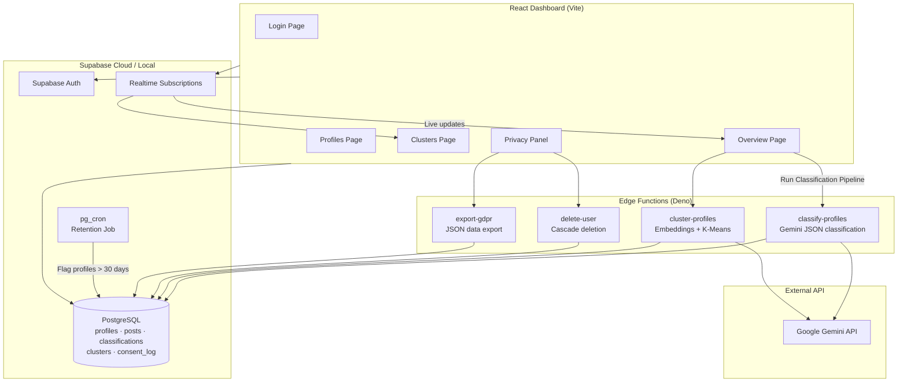

# PoliticaAI — Political Discourse Analysis System

An end-to-end full-stack application for analyzing synthetic political discourse data. The system generates fake user profiles and posts via LLM, classifies political leanings with AI, clusters ambiguous profiles using embedding-based k-means, and exposes everything through a real-time admin dashboard with built-in GDPR compliance features.

> **Important:** This project uses **synthetic data only**. No real social media data or personal information from real individuals is collected or processed.

---

## Table of Contents

- [Tech Stack](#tech-stack)
- [Architecture](#architecture)
- [Project Structure](#project-structure)
- [Database Schema](#database-schema)
- [Prerequisites](#prerequisites)
- [Local Setup](#local-setup)
- [Seeding Synthetic Data](#seeding-synthetic-data)
- [Running the Dashboard](#running-the-dashboard)
- [AI Classification Pipeline](#ai-classification-pipeline)
- [GDPR Features](#gdpr-features)
- [Real Data Considerations](#real-data-considerations)
- [Deployment](#deployment)
- [Environment Variables](#environment-variables)
- [Known Limitations](#known-limitations)

---

## Tech Stack

| Layer | Technology |
|---|---|
| **Frontend** | Vite + React 19 + TypeScript |
| **Styling** | Tailwind CSS v4, Lucide React icons, Recharts |
| **Backend / DB** | Supabase (PostgreSQL, Auth, Realtime, Edge Functions) |
| **AI Engine** | Google Gemini API (`gemini-2.5-flash-lite` for classification/keywords, `gemini-embedding-001` for clustering). The assignment allows Claude or OpenAI; Gemini was chosen for structured JSON and embeddings in one provider. |
| **Migrations** | Supabase CLI SQL migrations with Row Level Security (RLS) |
| **Scheduling** | `pg_cron` for data retention policy |
| **Deployment** | Vercel (frontend) + Supabase Cloud (backend) |

---

## Architecture

The application follows a three-tier architecture: a React SPA talks to Supabase over the client SDK, Supabase Edge Functions handle AI workloads server-side, and PostgreSQL stores all structured data with RLS enforced on every table.



### Data Flow

1. **Seed** — `scripts/seed.js` calls Gemini to generate 200 synthetic profiles (5–15 posts each) and writes them to Supabase along with consent log entries.
2. **Classify** — The dashboard triggers `classify-profiles`, which batches unclassified profiles (10 per invocation), sends post content to Gemini, and writes party + confidence scores to `classifications`.
3. **Cluster** — Profiles classified as `"unclear"` are passed to `cluster-profiles`, which generates text embeddings, runs k-means (k ≤ 3), creates cluster records, and links profiles via `cluster_id`.
4. **Realtime** — The Overview and Clusters pages subscribe to Postgres changes so charts and cards update without a page refresh.
5. **GDPR** — The Privacy Panel supports opt-out toggling, JSON export, cascade deletion, and surfaces retention flags set by the nightly cron job.

---

## Project Structure

```
political-dashboard/
├── frontend/                        # Vite + React dashboard
│   ├── src/
│   │   ├── App.tsx                  # Router, auth guard, layout
│   │   ├── lib/supabase.ts          # Supabase client
│   │   └── pages/
│   │       ├── Login.tsx            # Supabase Auth login
│   │       ├── Overview.tsx         # Stats, chart, pipeline trigger
│   │       ├── Profiles.tsx         # Searchable profile table + detail modal
│   │       ├── Clusters.tsx         # Cluster card grid
│   │       └── Privacy.tsx          # GDPR compliance center
│   └── package.json
├── supabase/
│   ├── migrations/                  # Versioned SQL schema + RLS + cron
│   └── functions/
│       ├── classify-profiles/       # AI party classification
│       ├── cluster-profiles/        # Embedding k-means clustering
│       ├── delete-user/             # Right to deletion
│       └── export-gdpr/             # Right to export
├── scripts/
│   ├── seed.js                      # LLM batch seeder (200 profiles)
│   └── finish-seed.js               # Fallback local seeder (30 profiles)
├── .env.example                     # Environment variable template
└── package.json                     # Root deps + seed script
```

---

## Database Schema

All tables live in the `public` schema with RLS enabled. Authenticated users (the admin) have full access via a simplified policy suitable for this assignment.

| Table | Purpose | Key Fields |
|---|---|---|
| `profiles` | Synthetic user profiles | `name`, `city`, `age_range`, `needs_deletion`, `created_at` |
| `posts` | Social media posts per profile | `profile_id` (FK → profiles, CASCADE), `content` |
| `classifications` | AI output per profile | `party`, `confidence` (0–1), `cluster_id`, `classified_at` |
| `clusters` | Cluster metadata | `label`, `top_keywords[]`, `sample_posts[]` |
| `consent_log` | GDPR consent records | `profile_id` (FK → profiles, CASCADE), `scope`, `source`, `timestamp` |

### Classification Parties

Each profile is classified into exactly one of:

- `Ra'am`
- `Hadash`
- `Balad`
- `Ta'al`
- `Jewish-sector party`
- `unclear` — triggers embedding-based clustering

### Migrations

| File | Description |
|---|---|
| `20260523162809_init_schema.sql` | Core tables, RLS policies, Realtime publication |
| `20260523221354_setup_retention_cron.sql` | `flag_expired_profiles()` + daily cron job |
| `20260524140000_consent_log_cascade.sql` | FK constraint with `ON DELETE CASCADE` on `consent_log` |

---

## Prerequisites

- **Node.js** 18+ and npm
- **Docker Desktop** (required for `export start`)
- **Supabase CLI** — [Install guide](https://supabase.com/docs/guides/cli/getting-started)
- **Google Gemini API key** — [Get a key](https://aistudio.google.com/apikey)

---

## Local Setup

### 1. Clone and install dependencies

```bash
git clone <your-repo-url>
cd political-dashboard

# Root dependencies (seed script)
npm install

# Frontend dependencies
cd frontend && npm install && cd ..
```

### 2. Configure environment variables

Copy the example file and fill in your values:

```bash
cp .env.example .env
```

Copy the frontend environment template:

```bash
cp frontend/.env.example frontend/.env.local
```

Then set `VITE_SUPABASE_URL` and `VITE_SUPABASE_ANON_KEY` from `supabase start` output or your cloud project.

The root `.env` also needs `SUPABASE_SERVICE_ROLE_KEY` and `GEMINI_API_KEY` for seeding and edge functions.

### 3. Start Supabase locally

```bash
supabase start
```

After startup, note the **API URL**, **anon key**, and **service_role key** from the CLI output. Update your `.env` and `frontend/.env.local` accordingly.

Apply migrations (done automatically on `supabase start`, but can be re-run):

```bash
supabase db reset
```

### 4. Create an admin user

Open Supabase Studio at `http://127.0.0.1:54323`, go to **Authentication → Users**, and create a user with email/password. This is the account used to log into the dashboard.

Alternatively, via the Supabase JS client or Auth API:

```bash
# Example: create user through Studio UI is the simplest approach
```

### 5. Serve edge functions locally

In a separate terminal:

```bash
supabase functions serve
```

Set secrets for local function execution:

```bash
supabase secrets set GEMINI_API_KEY=your_key_here
```

---

## Seeding Synthetic Data

The seed script generates **200 profiles** in batches of 10 using Gemini, with 5–15 posts and a consent log entry per profile.

```bash
# From project root — requires .env with SUPABASE_SERVICE_ROLE_KEY and GEMINI_API_KEY
npm run seed
```

The script includes automatic retry logic for API rate limits (429/503) with backoff between batches. Expect ~20 API calls with 10-second pauses — total runtime is roughly 5–10 minutes.

**Fallback seeder:** If the LLM seeder fails partway through, `scripts/finish-seed.js` can insert the remaining profiles using procedurally generated local data:

```bash
node scripts/finish-seed.js
```

---

## Running the Dashboard

```bash
cd frontend
npm run dev
```

Open **http://localhost:5173**, sign in with your admin credentials, and navigate the four dashboard views:

| Page | Route | Features |
|---|---|---|
| **Overview** | `/` | Total/classified/unclassified counts, party distribution pie chart, "Run Classification Pipeline" button, realtime updates |
| **Profiles** | `/profiles` | Searchable/sortable table, filter by party/cluster/consent, click-through detail modal with posts and AI results |
| **Clusters** | `/clusters` | Card grid showing cluster size, dominant party, keywords, and sample posts |
| **Privacy Panel** | `/privacy` | Consent status, opt-out toggle, retention flags, export JSON, cascade deletion |

---

## AI Classification Pipeline

Triggered from the **Overview** page via **Run Classification Pipeline**. The frontend orchestrates two phases:

### Phase 1 — Classification (`classify-profiles`)

- Fetches profiles without a `classifications` row
- Processes **10 profiles per invocation** (Edge Function timeout safety)
- Sends demographics + post content to Gemini with a strict JSON schema
- Writes `party` and `confidence` (clamped 0–1) to the database
- Loops until all profiles are classified (max 25 rounds)

### Phase 2 — Clustering (`cluster-profiles`)

- Finds profiles classified as `"unclear"` with no `cluster_id`
- Processes **10 profiles per invocation** (timeout safety, same as classification)
- Generates text embeddings via `gemini-embedding-001`
- Runs **k-means** clustering (k = min(3, batch size))
- Extracts **top keywords** per cluster via Gemini from member posts
- Creates cluster records with labels, keywords, and sample posts
- Updates `classifications.cluster_id` for each member
- Loops until no unclustered unclear profiles remain (max 10 rounds)

---

## GDPR Features

All GDPR requirements are implemented as **working application features**, not documentation-only.

| Requirement | Implementation |
|---|---|
| **Consent record** | Every seeded profile gets a `consent_log` entry (`scope`, `source`, `timestamp`). Opt-out/opt-in changes append new audit entries. |
| **Right to deletion** | Privacy Panel "Purge Data" button invokes `delete-user` Edge Function. Deleting a profile cascades to `posts`, `classifications`, and `consent_log` via FK constraints. |
| **Right to export** | "Export" button invokes `export-gdpr` Edge Function and downloads a JSON file containing profile, posts, classification, and full consent history. |
| **Retention policy** | `pg_cron` job runs daily at midnight UTC, setting `needs_deletion = true` on profiles older than 30 days. The Privacy Panel shows retention status (compliant / expiring soon / expired / flagged) and deletion reason badges. |
| **Opt-out toggle** | Admin can mark a profile for deletion via the Privacy Panel toggle, which updates `needs_deletion` and logs the consent change. |

---

## Real Data Considerations

If this system were deployed against **real social media or voter data** instead of synthetic LLM-generated content, the following changes would be mandatory:

**Legal basis and consent.** Real data processing requires a documented lawful basis under GDPR (typically explicit, granular, revocable consent — not a blanket "Political discourse analysis" scope). Consent would need version tracking, purpose limitation per scope, and age verification for minors. The current single admin toggle would be replaced by user-facing consent flows with clear privacy notices in the user's language.

**Data minimization and pseudonymization.** We would store only fields strictly necessary for analysis. Profile identifiers would be pseudonymized or hashed, and raw post content might be processed ephemerally (analyzed in-memory, storing only classification outputs). Demographic fields like `city` and `age_range` would require justification and potentially aggregation to prevent re-identification.

**Security and access control.** The current RLS policy grants all authenticated users full table access — acceptable for a single-admin assignment, but unacceptable in production. We would implement role-based policies separating analysts, admins, and data subjects. Edge Functions would validate JWT claims rather than relying solely on the service role key. All API keys would live in a secrets manager with rotation policies, and data would be encrypted at rest and in transit.

**Deletion and retention.** The 30-day retention flag would become a configurable, auditable policy with legal review. Deletion would need to propagate to backups, analytics caches, embedding vector stores, and any third-party AI provider logs (requiring data processing agreements with Gemini/OpenAI). A deletion certificate would be generated and stored for compliance proof.

**AI accountability.** Real classifications affecting people require human review workflows, bias auditing across demographic groups, explainability logs (why a classification was made), and the ability to contest results. The current confidence score would feed into a review queue rather than being displayed as ground truth.

**Cross-border transfers.** If the AI provider or hosting region is outside the EU/EEA, Standard Contractual Clauses (SCCs) and transfer impact assessments would be required. Local data residency options (EU-hosted Supabase, on-premise models) would be evaluated.

**Monitoring and breach response.** Production deployment would require audit logging of all data access, automated anomaly detection, a 72-hour breach notification procedure, and regular Data Protection Impact Assessments (DPIAs) given the sensitive nature of political profiling.

---

## Deployment

### Supabase Cloud

1. Create a project at [supabase.com](https://supabase.com)
2. Link your local project: `supabase link --project-ref <ref>`
3. Push migrations: `supabase db push`
4. Deploy edge functions:
   ```bash
   supabase functions deploy classify-profiles
   supabase functions deploy cluster-profiles
   supabase functions deploy delete-user
   supabase functions deploy export-gdpr
   ```
5. Set production secrets:
   ```bash
   supabase secrets set GEMINI_API_KEY=your_production_key
   ```
6. Create an admin user in the Supabase Dashboard → Authentication
7. Enable Realtime on `classifications` and `clusters` tables (already in migration)

> **Note:** `pg_cron` must be enabled on your Supabase project for the retention policy. On hosted Supabase, enable the `pg_cron` extension via the Dashboard → Database → Extensions.

### Frontend (Vercel)

1. Import the repository into [Vercel](https://vercel.com)
2. Set the **Root Directory** to `frontend`
3. Add environment variables:
   - `VITE_SUPABASE_URL` — your Supabase project URL
   - `VITE_SUPABASE_ANON_KEY` — your Supabase anon key
4. Deploy

Build command: `npm run build`  
Output directory: `dist`

---

## Environment Variables

| Variable | Required By | Description |
|---|---|---|
| `VITE_SUPABASE_URL` | Frontend, seed script | Supabase project API URL |
| `VITE_SUPABASE_ANON_KEY` | Frontend | Supabase anonymous/public key |
| `SUPABASE_SERVICE_ROLE_KEY` | Seed script, Edge Functions | Service role key (bypasses RLS — keep secret) |
| `SERVICE_ROLE_KEY` | Edge Functions (alias) | Alternative name checked by some functions |
| `GEMINI_API_KEY` | Seed script, Edge Functions | Google Gemini API key |

See [`.env.example`](.env.example) for the template.

---

## Known Limitations

- **Synthetic data only** — All profiles and posts are LLM-generated. Classification accuracy is illustrative, not authoritative.
- **Batch processing** — Classification and clustering each handle 10 profiles per Edge Function call to avoid timeouts. Full classification of 200 profiles requires ~20 sequential invocations.
- **Simplified RLS** — A single `authenticated_all` policy grants full access to any logged-in user. Production would require granular role-based policies.
- **No automated purge** — The retention cron flags profiles for deletion but does not auto-delete them. An admin must confirm deletion via the Privacy Panel.
- **Single admin model** — No multi-tenant or role hierarchy. One admin account is sufficient per assignment requirements.
- **Gemini rate limits** — Free-tier API limits may slow seeding and classification. The seed script retries on 429/503 errors and validates 5–15 posts per profile, but large runs may require patience or a paid API tier.
- **Edge function auth** — Functions require a valid Supabase Auth JWT (`verify_jwt = true`). Only logged-in admins can invoke classification, export, or deletion.

---

## License

This project was built as a home assignment submission. All data is synthetic and generated for demonstration purposes only.
